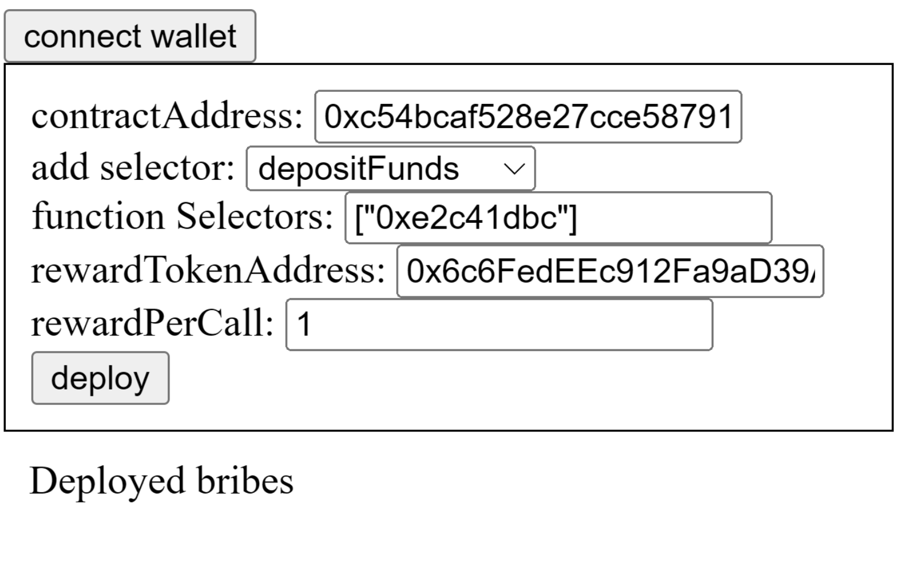
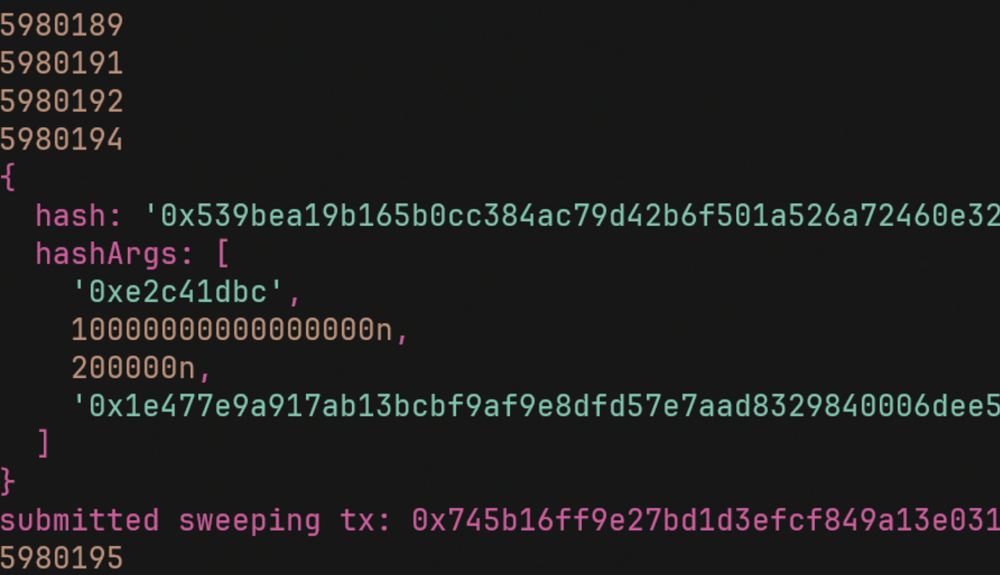

# InclusionBribes
ETHBerlin Hackathon 2024 entry

We worked on a solution to incentivize block producers to include transactions from censored or sanctioned smart contracts. 
This is what we came up with during the ETHBerlin04 Hackathon

# Prerequisites
you will need:

0. [Github](https://git-scm.com/downloads)
1. [Node.Js](https://nodejs.org/en/download/package-manager)
2. [Foundry](https://book.getfoundry.sh/getting-started/installation)
3. [yarn](https://yarnpkg.com/)/[pnpm](https://yarnpkg.com/)
5. [metamask](https://www.alchemy.com/faucets/ethereum-sepolia)
6. finally some [Sepolia ETH](https://www.alchemy.com/faucets/ethereum-sepolia)

# Installation
+ You need to ```git clone https://github.com/nodestarQ/antiCensorshipBribes.git``` and ```cd``` into the root folder.
+ Go ahead and do a ```yarn install:all``` this will install all the necessary dependencies.
+ The ```AntiCensorshipBriberFactory``` and ```TwisterMonies``` Smart Contract (that stands in as a placeholder for censored contracts) have been deployed on the Ethereum Sepolia Testnet.

# Create Bribe Smart Contract from the Factory
+ ```yarn deployBribesUi``` to run it


# Sweeper Script
+ run ```yarn run:sweep``` to start the sweeper script


# "Censored" Contract
+  ```yarn run:twister`` is going to serve the frontend for our mock censored smart contract. Connect with the website through MetaMask, Select an amount to deposit and press on the ```Deposit``` button.`
+ Once the transaction gets confirmed it will be picked up by the ```sweeper```, which will claim the rewards and include the block.
